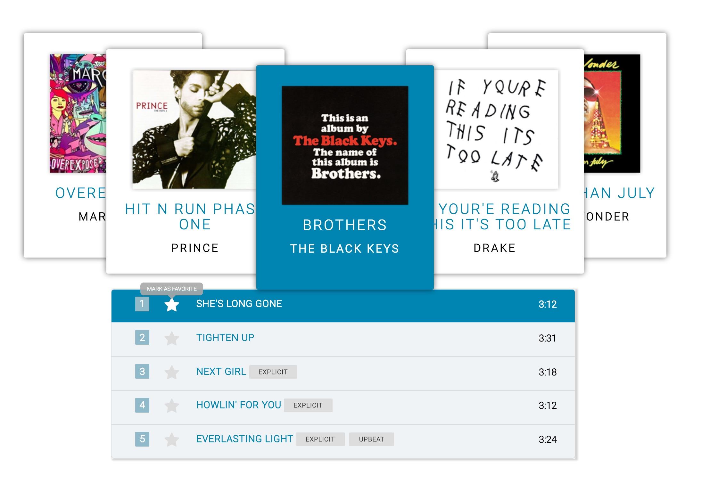

# Serverless Jukebox JSON data

A serverless app to provide json data for an online jukebox carousel.

====

See this in action at: https://jukebox-carousel.herokuapp.com/

Github repo for the frontend can be found at https://github.com/keithsktang/jukebox
